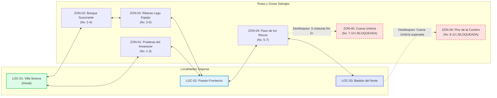

# Documento de diseño: Aethelgard: Sendas y Criaturas

## 1. Nombre y premisa
- **Nombre del juego:** *Aethelgard: Sendas y Criaturas*
- **Premisa:** Como explorador novato del gremio de Villa Serena, recorres caminos y tierras salvajes forjando lazos con criaturas míticas para superar desafíos territoriales y desentrañar los secretos ancestrales de Aethelgard.

---

## 2. Historia breve
Tras la fractura del Velo Astral en el continente de Aethelgard, energías primordiales despertaron a criaturas míticas que ahora rondan valles, bosques y ruinas antiguas. Las villas humanas, antes aisladas, dependen de los Guardianes de Sendas: exploradores capaces de comprender el comportamiento de estas criaturas, vincularse con ellas mediante talismanes resonantes y defender los caminos comerciales.

Como nuevo recluta del gremio en Villa Serena, inicias tu viaje con una criatura compañera. Deberás explorar las tierras agrestes, vencer y calmar bestias hostiles, adquirir provisiones en los puestos de avanzada y descubrir los secretos de la Cueva Umbría, cuyo sello ancestral solo cederá ante un explorador de probada destreza y progreso en su equipo.

---

## 3. Reglas generales
El sistema de juego se articula mediante interfaces web declarativas (texto, tarjetas y botones) sin motores gráficos ni coordenadas continuas, gobernado por reglas deterministas y probabilísticas ejecutadas en el servidor:

1. **Exploración:** El jugador navega a través de una red topológica de localidades seguras y zonas salvajes interconectadas. En cada zona, puede iniciar acciones de exploración que arrojan resultados mediante tablas de eventos ponderadas: avistar una criatura hostil (encuentro), hallar un cofre o recurso (recompensa de inventario/dinero), o registrar un evento narrativo en su bitácora.
2. **Combate por turnos:** Al activarse un encuentro, la criatura líder del equipo del jugador se enfrenta a la criatura salvaje en un combate táctico por turnos estrictos. Cada turno, el jugador elige una acción: ejecutar un movimiento de ataque, utilizar un consumible del inventario (poción o talismán), ordenar la huida o cambiar de criatura activa.
3. **Captura:** La captura se resuelve durante el combate como una acción de turno mediante el uso de un talismán de captura. El éxito se evalúa en el servidor considerando la dificultad intrínseca de la especie (`tasaCaptura`), el estado actual de salud del objetivo (a menor HP, mayor probabilidad) y el multiplicador del talismán. Al capturar con éxito, la criatura se añade al equipo activo (hasta 6) o se transfiere de forma segura al almacén central.
4. **Curación y gestión de equipo:** En las localidades principales, los exploradores tienen acceso a centros de curación gratuitos para restablecer al 100 % los puntos de salud de sus compañeros. Asimismo, acceden al almacén para intercambiar miembros entre el equipo activo y la reserva.
5. **Comercio e inventario:** Las tiendas en los asentamientos permiten adquirir talismanes de captura y pociones de vida mediante las monedas acumuladas en combates y exploraciones.
6. **Progresión y desbloqueo:** Cada victoria otorga experiencia (XP). Al acumular la XP requerida, la criatura incrementa su nivel y sus atributos de combate. El progreso del jugador (nivel de criaturas, victorias y objetos clave) actúa como condición habilitadora para desbloquear el acceso a zonas protegidas o de alta dificultad.

---

## 4. Mundo de Aethelgard

### 4.1 Localidades principales
Asentamientos seguros que ofrecen servicios permanentes al jugador:

| ID | Nombre | Descripción | Servicios disponibles |
| --- | --- | --- | --- |
| `LOC-01` | Villa Serena | Aldea pacífica en el valle donde inician los reclutas del gremio. | Centro de curación, selección de inicial, bitácora del gremio. |
| `LOC-02` | Puesto Fronterizo del Río | Cruce comercial ribereño resguardado por mercaderes y exploradores veteranos. | Tienda de provisiones, almacén de criaturas, centro de curación menor. |
| `LOC-03` | Bastión del Norte | Imponente fortaleza de piedra erigida sobre los riscos septentrionales. | Gran bazar de talismanes, santuario de curación completa, registro de expediciones. |

### 4.2 Zonas explorables
Rutas y parajes naturales que albergan vida salvaje y desafíos:

| ID | Nombre | Conexiones inmediatas | Nivel sugerido | Requisito de desbloqueo (`M-PRO`) |
| --- | --- | --- | --- | --- |
| `ZON-01` | Praderas del Amanecer | `LOC-01` (Villa Serena), `LOC-02` (Puesto Fronterizo) | Nivel 1–3 | Ninguno (acceso inicial libre). |
| `ZON-02` | Bosque Susurrante | `LOC-01` (Villa Serena), `ZON-03` (Riberas Lago Espejo) | Nivel 2–4 | Ninguno (acceso inicial libre). |
| `ZON-03` | Riberas del Lago Espejo | `ZON-02` (Bosque Susurrante), `LOC-02` (Puesto Fronterizo) | Nivel 3–5 | Ninguno (acceso libre). |
| `ZON-04` | Paso de los Riscos | `LOC-02` (Puesto Fronterizo), `LOC-03` (Bastión del Norte), `ZON-05` (Cueva Umbría) | Nivel 5–7 | Ninguno (acceso libre desde Puesto Fronterizo). |
| `ZON-05` | Cueva Umbría | `ZON-04` (Paso de los Riscos), `ZON-06` (Pico de la Cumbre) | Nivel 7–10 | **Bloqueada:** Requiere poseer al menos 3 criaturas en el equipo de nivel ≥ 5 y haber alcanzado el Puesto Fronterizo. |
| `ZON-06` | Pico de la Cumbre | `LOC-03` (Bastión del Norte), `ZON-05` (Cueva Umbría) | Nivel 8–12 | **Bloqueada:** Requiere haber superado la expedición de la Cueva Umbría y rango de explorador veterano en el Bastión del Norte. |

### 4.3 Grafo de conexiones del mundo

---

## 5. Los 13 módulos obligatorios sobre papel

| ID | Nombre | Qué hace en el juego | Pantallas | Endpoints |
| --- | --- | --- | --- | --- |
| `M-USR` | Usuarios | Registro de cuenta, inicio de sesión y validación de tokens de sesión. | `PantallaIngreso`, `PantallaRegistro` | `POST /api/usuarios/registro`, `POST /api/usuarios/login`, `POST /api/usuarios/logout` |
| `M-PJ` | Personaje | Creación y visualización del explorador, ubicación actual, saldo de monedas y estado de progreso. | `PantallaCrearPersonaje`, `PantallaHubUbicacion` | `POST /api/personajes`, `GET /api/personajes/activo` |
| `M-MUN` | Mundo | Consulta de localidades, rutas conectadas, desplazamientos válidos y estado de accesos. | `PantallaHubUbicacion` | `GET /api/mundo/ubicacion-actual`, `POST /api/mundo/viajar` |
| `M-EXP` | Exploración | Ejecución de eventos de exploración probabilística al recorrer una zona activa. | `PantallaExploracion` | `POST /api/exploracion/explorar` |
| `M-CRI` | Criaturas | Catálogo de especies base, fichas detalladas de estadísticas y cálculo de niveles. | `PantallaCatalogo`, `PantallaCrearPersonaje` | `GET /api/especies`, `GET /api/especies/:slug` |
| `M-ENC` | Encuentros | Generación y control de encuentros con criaturas salvajes según tablas de aparición de zona. | `PantallaExploracion`, `PantallaCombate` | `GET /api/encuentros/activo` |
| `M-COM` | Combate | Resolución del combate por turnos (ataques, daño, orden de turnos, estado de combate). | `PantallaCombate` | `POST /api/combate/atacar`, `POST /api/combate/huir` |
| `M-CAP` | Captura | Intento de captura de criaturas durante el combate mediante talismanes, validado por servidor. | `PantallaCombate` | `POST /api/combate/capturar` |
| `M-EQU` | Equipo | Gestión de hasta 6 criaturas activas en el equipo y transferencia al almacén de reserva. | `PantallaEquipo`, `PantallaAlmacen` | `GET /api/equipo`, `GET /api/almacen`, `POST /api/equipo/transferir` |
| `M-INV` | Inventario | Administración de objetos consumibles (talismanes, pociones) y compra en tiendas de localidades. | `PantallaInventario`, `PantallaTienda` | `GET /api/inventario`, `POST /api/tienda/comprar`, `POST /api/inventario/usar` |
| `M-CUR` | Curación | Restauración completa de la salud de todas las criaturas del equipo en centros autorizados. | `PantallaCuracion` | `POST /api/curacion/restaurar` |
| `M-PRO` | Progreso | Registro de hitos, verificación de requisitos y desbloqueo formal de zonas restringidas. | `PantallaHubUbicacion` | `GET /api/progreso/desbloqueos`, `POST /api/progreso/verificar-zona` |
| `M-HIS` | Historial | Registro cronológico y consulta de eventos destacados de exploración, combates y capturas. | `PantallaHistorial` | `GET /api/historial` |

---

## 6. Glosario de términos del sistema

- **Almacén:** Sistema de depósito seguro donde se alojan las criaturas capturadas que exceden el límite máximo del equipo activo (6) o que el jugador decide resguardar temporalmente.
- **Captura:** Acción ejecutada durante un combate en la que el explorador emplea un talismán para intentar incorporar a la criatura salvaje a su posesión permanente.
- **Clase de Armadura (`armor_class` / AC):** Atributo numérico de Open5e que representa la dificultad para impactar y dañar a una criatura; base para el cálculo de `defensaBase`.
- **Clave Externa (`key`):** Identificador alfanumérico único asignado por la API de Open5e a cada criatura dentro del documento `srd-2024` (ejemplo: `srd-2024_wolf`).
- **Criatura:** Instancia individual de una especie capturada o enfrentada por el jugador, dotada de nivel propio, puntos de golpe actuales, experiencia y pertenencia a un personaje.
- **Encuentro:** Estado transitorio del juego originado en una zona explorada que enfrenta al jugador a una criatura salvaje específica o a un evento del entorno.
- **Equipo:** Grupo activo de hasta un máximo de 6 criaturas que acompañan al explorador en sus viajes y pueden combatir en los encuentros.
- **Especie:** Registro arquetípico del catálogo (con datos base de Open5e y normalización) que define los atributos, tipos y movimientos posibles de una familia de criaturas.
- **Huida:** Acción de combate mediante la cual el jugador intenta retirarse del encuentro para preservar a su criatura activa, sujeta a una probabilidad calculada por el servidor.
- **Índice de Desafío (`challenge_rating` / CR):** Medida de peligrosidad y poder de una criatura en Open5e; empleado en el juego para calibrar la dificultad de captura y el nivel sugerido.
- **Localidad:** Asentamiento civilizado y seguro (aldea, pueblo o fortaleza) dotado de servicios donde no ocurren encuentros hostiles.
- **Nivel:** Escala numérica del desarrollo de una criatura (del 1 en adelante) que refleja su crecimiento en poder y atributos.
- **Puntos de Golpe (`hit_points` / HP):** Medida de la salud y resistencia de una criatura; al llegar a 0 la criatura queda debilitada y fuera de combate.
- **Puntos de Experiencia (XP):** Valor acumulado por una criatura tras vencer a adversarios en combate que determina cuándo asciende de nivel.
- **Zona:** Territorio exterior o ruta silvestre sujeta a peligros, donde se ejecutan acciones de exploración y rigen tablas de aparición de criaturas y eventos.
