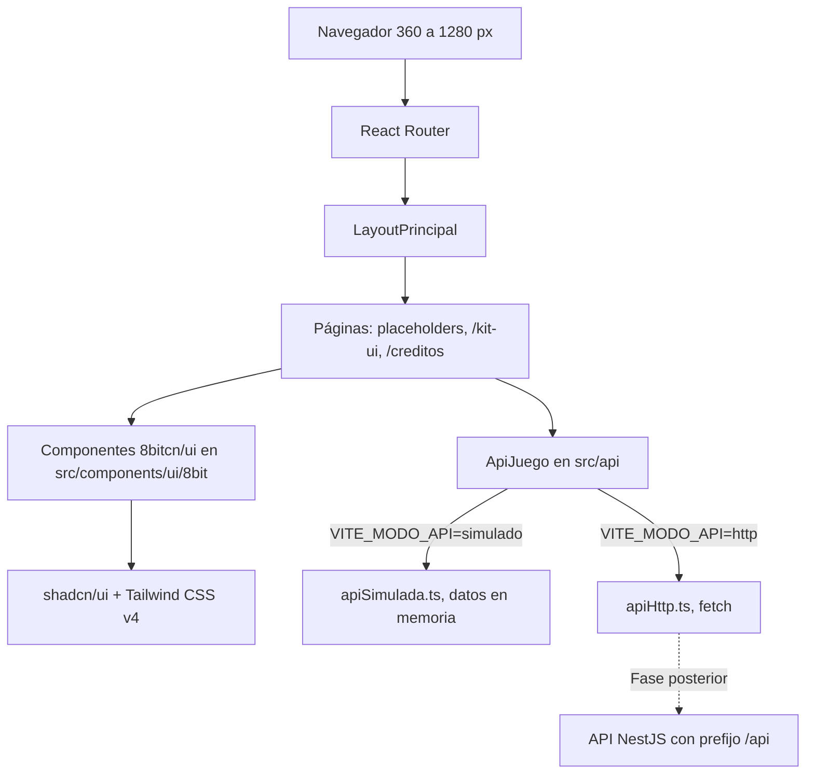

# Informe Técnico - Fase 2: Fundación del Front-End y Sistema de Diseño (Avance 2, Parte 1)

Este documento constituye la sección correspondiente a la **Fase 2 (Fundación del Front-End y Sistema de Diseño)** del Informe Técnico del Proyecto Integrador ISC-305. Documenta la arquitectura, el sistema visual retro, la capa de abstracción de datos y la verificación responsive de la aplicación cliente en `apps/web`.

---

## 1. Objetivo de la fase y requisitos cubiertos

**Objetivo general:** Establecer la infraestructura base del Front-End en `apps/web` utilizando React 19, Vite, TypeScript y Tailwind CSS v4, integrando los 17 componentes de interfaz retro del registro de 8bitcn/ui sobre shadcn/ui traducidos al español (R1), un `LayoutPrincipal` semántico y mobile-first con React Router en modo biblioteca, la capa desacoplada `ApiJuego` con modo simulado y modo HTTP, y la vista de demostración `/kit-ui`.

**Requisitos e identificadores cubiertos:**
- `T-2`: Aplicación web responsiva desarrollada con React y TypeScript sobre Vite.
- `T-3`: Sistema de diseño modular basado en componentes reutilizables (shadcn/ui + 8bitcn/ui).
- `A-1`: Interfaz de usuario orientada a la web, optimizada para resoluciones móviles y de escritorio.
- `A-2`: Ausencia de mapas gráficos o lienzos 2D/3D pesados; navegación topológica basada en componentes DOM.
- `A-3`: Diseño retro inspirado en estética de 8 bits con bordes pixelados, paleta de alto contraste y retro.css.
- `ARQ`: Aislamiento estricto de la presentación respecto a la persistencia o lógica de servidor mediante la interfaz `ApiJuego`.
- `X-UI`: Arranque del sistema de diseño integral y catálogo visual de componentes en `/kit-ui`.

---

## 2. Stack tecnológico y versiones exactas

En cumplimiento de las normas de estabilidad del monorepo, todas las dependencias del proyecto web se encuentran fijadas sin comodines de rango (`^` ni `~`), reguladas mediante `.npmrc` con `save-exact=true`:

| Paquete | Versión instalada | Propósito en el proyecto |
| --- | --- | --- |
| `react` | `19.3.0` | Biblioteca base para renderizado reactivo de la interfaz de usuario |
| `react-dom` | `19.3.0` | Renderizado y manipulación del árbol DOM en navegadores |
| `vite` | `8.3.3` | Servidor de desarrollo ultrarrápido y empaquetador de producción |
| `typescript` | `6.0.3` | Tipado estático y chequeo estricto del código fuente |
| `tailwindcss` | `4.3.3` | Motor de estilos basado en utilidades modernas |
| `@tailwindcss/vite` | `4.3.3` | Integración nativa de Tailwind CSS v4 en el pipeline de Vite |
| `shadcn` (CLI) | `4.21.4` | Herramienta de distribución de componentes basada en código fuente |
| `react-router` | `8.4.0` | Enrutamiento declarativo del lado del cliente en modo biblioteca |
| `radix-ui` | `1.7.0` | Primitivas accesibles y desprovistas de estilos de Radix |
| `lucide-react` | `1.52.0` | Iconografía vectorizada para componentes de soporte |
| `class-variance-authority` | `0.7.1` | Gestión declarativa de variantes visuales (`cva`) |
| `cn` | `0.4.0` | Utilidad de composición condicional de clases CSS |
| `sonner` | `2.0.8` | Motor de notificaciones emergentes (toasts) |
| `next-themes` | `0.4.6` | Soporte de temas claro/oscuro instalado por el CLI |
| `tw-animate-css` | `1.4.0` | Utilidades de animación para Tailwind CSS |
| `@radix-ui/react-alert-dialog` | `1.1.24` | Tipado específico para modales de confirmación |
| `@radix-ui/react-label` | `2.1.16` | Tipado específico para etiquetas de formularios |
| `@radix-ui/react-select` | `2.3.8` | Tipado específico para listas desplegables |
| `@radix-ui/react-tabs` | `1.1.22` | Tipado específico para pestañas de navegación |

---

## 3. Estructura de código en `apps/web/src`

El código de la aplicación cliente organiza sus responsabilidades de forma clara y desacoplada:

```text
apps/web/src/
├── api/                                # Capa de datos y abstracción de red (ARQ)
│   ├── ApiJuego.ts                     # Tipos de petición/respuesta y contrato ApiJuego
│   ├── apiHttp.ts                      # Implementación basada en fetch (/api)
│   ├── apiSimulada.ts                  # Implementación en memoria con retardo realista
│   └── index.ts                        # Selector de implementación por VITE_MODO_API
├── componentes/                        # Componentes transversales de la aplicación
│   └── LayoutPrincipal.tsx             # Shell estructural mobile-first (header, nav, main, footer)
├── paginas/                            # Vistas completas de la aplicación
│   ├── PaginaCreditos.tsx              # Licencias de 8bitcn y atribución de Open5e
│   ├── PaginaKitUi.tsx                 # Catálogo interactivo de los 17 componentes de UI
│   ├── PaginaNoEncontrada.tsx          # Manejo de rutas inexistentes (404)
│   └── PaginaPendiente.tsx             # Componente reutilizable para pantallas placeholder
├── components/                         # Código generado y copiado por shadcn CLI
│   └── ui/                             # Primitivas base de shadcn (button, card, dialog, etc.)
│       └── 8bit/                       # Componentes retro temáticos de 8bitcn/ui
│           ├── styles/retro.css        # Hoja de estilos con bordes pixelados y fuentes retro
│           ├── alert-dialog.tsx
│           ├── badge.tsx
│           ├── button.tsx
│           ├── card.tsx
│           ├── dialog.tsx
│           ├── enemy-health-display.tsx
│           ├── health-bar.tsx
│           ├── input.tsx
│           ├── label.tsx
│           ├── progress.tsx
│           ├── select.tsx
│           ├── skeleton.tsx
│           ├── spinner.tsx
│           ├── table.tsx
│           ├── tabs.tsx
│           ├── toast.tsx
│           └── xp-bar.tsx
├── lib/
│   └── utils.ts                        # Helper cn para combinación de clases
├── App.tsx                             # Configuración del enrutador React Router
├── index.css                           # Importación central de Tailwind CSS v4
├── main.tsx                            # Punto de entrada de renderizado React
└── vite-env.d.ts                       # Declaración de variables de entorno de Vite
```

*Nota técnica sobre la ruta `components/ui/8bit`:* La estructura en inglés de esta carpeta la impone el CLI oficial de distribución de shadcn/ui. Constituye una excepción técnica admitida formalmente en el glosario del proyecto (§1 y R1).

---

## 4. Sistema de diseño: 8bitcn/ui y traducción R1

### 4.1 Justificación y selección
8bitcn/ui fue seleccionado como el sistema de diseño del proyecto por cumplir de manera directa con el requisito temático `A-3` (diseño retro de 8 bits). A diferencia de implementar estilos retro desde cero, 8bitcn adopta un patrón de envoltura (*wrapper*) sobre shadcn/ui y Radix UI, preservando la accesibilidad web (WAI-ARIA, navegación por teclado), la semántica HTML nativa y la capacidad de personalización con Tailwind CSS.

### 4.2 Proceso de incorporación y traducción R1
Los componentes se descargaron directamente al repositorio utilizando el CLI oficial:
```powershell
pnpm dlx shadcn@latest add "@8bitcn/button"
pnpm dlx shadcn@latest add "@8bitcn/card" "@8bitcn/badge" ...
```
Posteriormente, en estricto cumplimiento de la regla **R1**, se revisaron todos los archivos copiados y se tradujeron los textos visibles y etiquetas accesibles sin alterar identificadores de exportación ni props:
- `aria-label="Loading"` → `aria-label="Cargando"` (en `spinner.tsx`).
- `<span className="sr-only">Close</span>` → `<span className="sr-only">Cerrar</span>` (en `dialog.tsx`).
- `levelUpMessage = "LEVEL UP!"` → `levelUpMessage = "¡SUBIÓ DE NIVEL!"` (en `xp-bar.tsx`).
- `Lv.{level}` → `Niv.{level}` (en `enemy-health-display.tsx`).

### 4.3 Tabla de correspondencia de componentes en el juego

| Componente | Rol en el sistema de diseño | Utilización dentro de Aethelgard |
| --- | --- | --- |
| `button` | Botón interactivo retro | Acciones de combate, navegación y confirmaciones |
| `badge` | Etiqueta de clasificación | Tipos de criaturas (Bestia, Aviar), estados y rarezas |
| `card` | Contenedor de contenido estructurado | Fichas de criaturas, cartas de equipo y paneles de estado |
| `input` | Campo de texto con borde pixelado | Entrada de credenciales y nombre del explorador |
| `label` | Etiqueta accesible de formulario | Descripción asociada a inputs y selectores |
| `select` | Menú desplegable estilizado | Selección de criatura inicial y filtros del catálogo |
| `dialog` | Modal interactivo flotante | Encuentros silvestres y eventos contextuales de zona |
| `alert-dialog` | Modal crítico con bloqueo | Confirmación de huida o transferencias de criaturas |
| `tabs` | Selector de pestañas de contenido | Conmutación entre Equipo, Almacén y Ajustes |
| `table` | Tabla de datos con caption | Vistas de inventario de objetos e historial de eventos |
| `toast` | Notificación temporal no invasiva | Avisos de captura exitosa, recompensas y subida de nivel |
| `progress` | Barra de progreso general | Porcentaje de exploración de zonas y expediciones |
| `health-bar` | Barra de vitalidad para aliados | Puntos de vida (HP) de las criaturas del explorador |
| `enemy-health-display` | Panel completo de salud rival | Nombre, nivel y barra de HP de criaturas enemigas |
| `xp-bar` | Barra de experiencia con animación | Indicador de XP y efecto animado al subir de nivel |
| `skeleton` | Bloque visual de carga | Marcador de posición mientras se reciben datos asíncronos |
| `spinner` | Indicador de espera giratorio | Rueda retro animada durante peticiones de red |

---

## 5. Arquitectura de rutas y navegación

### 5.1 Enrutamiento declarativo
Se configuró `createBrowserRouter` de `react-router` estructurando a `LayoutPrincipal` como la ruta envolvente raíz (`/`). La ruta principal redirige automáticamente a `/ingreso`. Se generaron rutas placeholder reutilizables mediante `PaginaPendiente` para las 14 pantallas que serán desarrolladas en la Fase 3, manteniendo activos y reales los caminos `/kit-ui` y `/creditos`:

| Ruta | Pantalla asociada | Estado en Fase 2 |
| --- | --- | --- |
| `/` | — | Redirección declarativa hacia `/ingreso` |
| `/ingreso` | `PantallaIngreso` | Marcador de posición (`PaginaPendiente`) |
| `/registro` | `PantallaRegistro` | Marcador de posición (`PaginaPendiente`) |
| `/crear-personaje` | `PantallaCrearPersonaje` | Marcador de posición (`PaginaPendiente`) |
| `/hub` | `PantallaHubUbicacion` | Marcador de posición (`PaginaPendiente`) |
| `/exploracion` | `PantallaExploracion` | Marcador de posición (`PaginaPendiente`) |
| `/combate` | `PantallaCombate` | Marcador de posición (`PaginaPendiente`) |
| `/equipo` | `PantallaEquipo` | Marcador de posición (`PaginaPendiente`) |
| `/almacen` | `PantallaAlmacen` | Marcador de posición (`PaginaPendiente`) |
| `/inventario` | `PantallaInventario` | Marcador de posición (`PaginaPendiente`) |
| `/tienda` | `PantallaTienda` | Marcador de posición (`PaginaPendiente`) |
| `/curacion` | `PantallaCuracion` | Marcador de posición (`PaginaPendiente`) |
| `/catalogo` | `PantallaCatalogo` | Marcador de posición (`PaginaPendiente`) |
| `/historial` | `PantallaHistorial` | Marcador de posición (`PaginaPendiente`) |
| `/kit-ui` | — | Página interactiva real con los 17 componentes |
| `/creditos` | `PantallaCreditos` | Página interactiva real de licencias y autorías |
| `*` | `PaginaNoEncontrada` | Mensaje 404 con enlace hacia `/ingreso` |

### 5.2 Diagrama de arquitectura del Front-End
El flujo de renderizado y desacoplamiento de red se sintetiza en el siguiente diagrama ([docs/diagramas/arquitectura-frontend.mmd](../diagramas/arquitectura-frontend.mmd)):



---

## 6. Capa de abstracción `ApiJuego` (ARQ)

En cumplimiento del requisito arquitectónico `ARQ`, las páginas y componentes no realizan llamadas HTTP directas ni acoplan su código a la existencia del servidor backend:
1. **Contrato unificado (`ApiJuego.ts`):** Define los 25 métodos que cubren la totalidad de los endpoints del contrato REST ([docs/contrato-api.md](../contrato-api.md)), junto con la clase `ErrorApi` que expone los campos `estado` y `codigo`.
2. **Implementación HTTP (`apiHttp.ts`):** Emplea `fetch` nativo sobre `${VITE_URL_API}/api`, adjuntando cabeceras `Content-Type: application/json` y tokens `Authorization: Bearer <token>`, parseando las estructuras uniformes `{ error: { codigo, mensaje } }` y traduciendo errores de red a `SIN_CONEXION`.
3. **Implementación simulada (`apiSimulada.ts`):** Trabaja en memoria con datos consistentes basados en el catálogo de criaturas y el contrato REST, introduciendo retardos asíncronos controlados para validar estados de carga.
4. **Verificación estricta:** Ambas implementaciones aplican `satisfies ApiJuego`. Si el contrato y una implementación divergen, el compilador TypeScript aborta la construcción inmediatamente.
5. **Selector de modo:** Controlado en tiempo de ejecución por `VITE_MODO_API` (`simulado` o `http`), arrojando una excepción clara en español ante valores inválidos.

---

## 7. Cobertura de objetivos pedagógicos del curso (HTML, CSS y JS)

Tal como exige la sección §2 del plan maestro de desarrollo, la implementación de la Fase 2 cubre de forma práctica los fundamentos del curso:
- **Manipulación semántica del DOM:** React genera y gestiona árboles DOM basados en elementos HTML5 estándar (`<header>`, `<nav>`, `<main>`, `<footer>`, `<section>`, `<form>`, `<table>`, `<caption`). Se respeta la jerarquía de un único `<h1>` por pantalla.
- **Manejo de eventos:** Captura y control de eventos del usuario mediante `onClick` (disparo de modales y toasts) y `onSubmit` (prevención de recarga de página mediante `preventDefault`).
- **Peticiones asíncronas (`fetch`):** Implementadas nativamente en `apiHttp.ts` consumiendo APIs REST con manejo exhaustivo de estados HTTP, cabeceras y serialización JSON.
- **Validación de formularios:** El formulario en `/kit-ui` implementa validaciones nativas de HTML (`required`, `minLength={3}`) previas al envío, preparando el terreno para la validación con React Hook Form y Zod en la Fase 3.

---

## 8. Evidencia responsive y accesibilidad

### 8.1 Verificación responsive (360 px, 768 px y 1280 px)
Mediante pruebas automatizadas de navegador ejecutadas por el subagente de navegación con grabación visual WebP, se evaluó la vista `/kit-ui` y rutas placeholder en tres puntos de quiebre estándar:
- **360 × 640 px (Móvil compacto):** `scrollWidth` idéntico a `innerWidth` (360 px). Ausencia total de desbordamiento horizontal. Los elementos se apilan ordenadamente en una sola columna.
- **768 × 1024 px (Tableta):** `scrollWidth` idéntico a `innerWidth` (768 px). La retícula se distribuye fluidamente a dos columnas sin cortes.
- **1280 × 800 px (Escritorio):** `scrollWidth` idéntico a `innerWidth` (1280 px). Distribución a tres columnas centrada con márgenes confortables.

### 8.2 Accesibilidad e internacionalización
- **Idioma del documento:** Configurado formalmente con `<html lang="es">` en `index.html`.
- **Etiquetas accesibles:** Elementos interactivos cuentan con `aria-label` en español (ej. `aria-label="Cargando"` en spinners) y descripciones textuales para lectores de pantalla (`sr-only` en botones de cierre).
- **Semántica de datos:** Las tablas incluyen `<caption>` descriptivo y celdas diferenciadas de encabezado (`<TableHead>`).

---

## 9. Licencias de software y atribuciones

En conformidad con las normativas legales y académicas del proyecto:
1. **8bitcn/ui:** Distribuido bajo la Licencia MIT por su autor oficial (`Copyright (c) 2025 8bitcn`). Su aviso legal íntegro se expone en la vista accesible `/creditos` y en el archivo `README.md` de la raíz del monorepo.
2. **Open5e y SRD 5.2:** Datos estadísticos de criaturas derivados del documento `srd-2024`, licenciados bajo Creative Commons Attribution 4.0 International (CC BY 4.0). Se incluye la atribución literal exigida por Wizards of the Coast LLC tanto en `/creditos` como en la documentación del repositorio.
