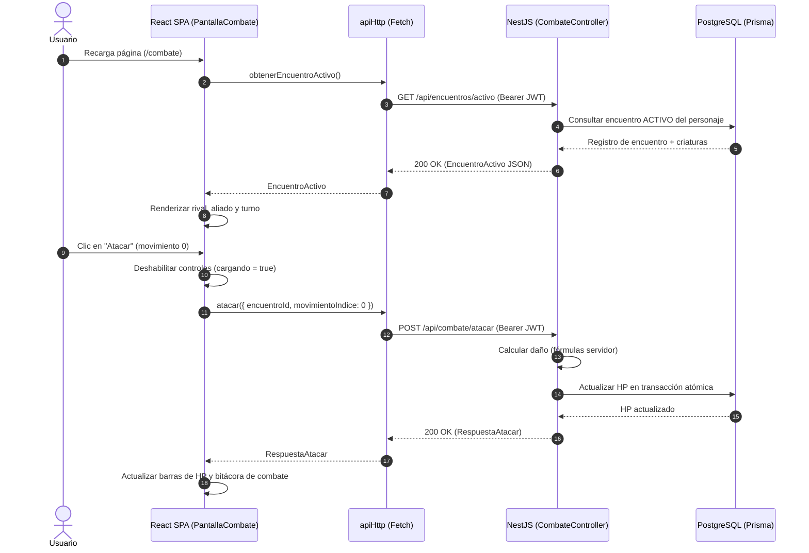

# Informe Técnico - Fase 4: Fundación del Back-End (Avance 3, Parte 1)

Este documento corresponde al capítulo de la **Fase 4 (Fundación del Back-End)** del Informe Técnico del Proyecto Integrador ISC-305. Registra la implementación de los cimientos del servidor de aplicaciones en `apps/api` utilizando NestJS, modularizado por dominios del juego, conectado a PostgreSQL mediante Prisma ORM con migraciones versionadas, validación global estricta con `ValidationPipe`, filtro unificado de excepciones `ExcepcionesFilter` conforme al contrato REST del proyecto, documentación viva interactiva en `/docs` con Swagger y sistema de autenticación completo (registro e inicio de sesión con JWT, contraseñas hasheadas con bcrypt, `AutenticacionGuard` global y decoradores `@Publico()` y `@UsuarioActual()`).

---

## 1. Introducción y cimientos del Back-End

**Objetivo general:** Establecer la base del servidor Back-End en `apps/api` garantizando una arquitectura limpia, tipada y desacoplada, con persistencia relacional en contenedor Docker, seguridad por diseño y documentación automática.

**Cumplimiento de hitos y requisitos:**
- `ARQ`: Arquitectura limpia por capas y módulos desacoplados en NestJS. La separación de responsabilidades evita la proliferación de abstracciones redundantes: los controladores atienden el tráfico HTTP y delegan la lógica a los servicios de dominio, los cuales interactúan de forma directa y tipada con `PrismaService`.
- `T-1`: Estructura del Back-End organizada en módulos orientados al dominio del juego (`autenticacion`, `usuarios`, `personajes`, `mundo`, `criaturas`, `encuentros`, `combate`, `inventario`, `tienda`, `historial` y `externo`).
- `T-4`: Exposición de endpoints REST funcionales consumibles mediante clientes HTTP estándar, Swagger o la aplicación web React.
- `T-5`: Conexión de persistencia con base de datos relacional PostgreSQL 17 en contenedor Docker (`aventura-postgres`) con comprobación de salud continua.
- `S-1`: Mecanismo integral de identidad y autenticación con tokens JWT y cifrado unidireccional de contraseñas.
- `S-7`: Gestión segura de variables de entorno mediante `@nestjs/config` con tipado, lectura desde `.env` no versionado y plantilla exhaustiva en `.env.example`.

---

## 2. Modelo de datos y persistencia con Prisma ORM

La persistencia del servidor se gestiona a través de Prisma ORM (versión 6.3.1), configurado contra PostgreSQL en `apps/api/prisma/schema.prisma`.

### 2.1 Esquema de datos inicial: modelo `Usuario`

Cumpliendo con la regla R1 del proyecto, los identificadores en el esquema se definen en español, con mapeo explícito de tablas y columnas al estándar relacional (`snake_case`):

```prisma
generator client {
  provider = "prisma-client-js"
}

datasource db {
  provider = "postgresql"
  url      = env("DATABASE_URL")
}

model Usuario {
  id                 String   @id @default(uuid())
  nombreUsuario      String   @unique @map("nombre_usuario")
  correo             String   @unique
  contrasenaHash     String   @map("contrasena_hash")
  fechaCreacion      DateTime @default(now()) @map("fecha_creacion")
  fechaActualizacion DateTime @updatedAt @map("fecha_actualizacion")

  @@map("usuario")
}
```

### 2.2 Estrategia de migraciones versionadas

Las alteraciones en la base de datos se versionan mediante Prisma Migrate:
- Se ejecutó la migración inicial `20261008184352_inicial`, creando el archivo `migration.sql` y registrando el estado en la tabla `_prisma_migrations`.
- La verificación contra PostgreSQL mediante el MCP `postgres` constató la existencia de las tablas `usuario` y `_prisma_migrations` en el esquema público (`public`).

### 2.3 Servicio singleton `PrismaService`

Siguiendo el principio de desarrollo simple y eficiente (*lazy developer*), no se introdujeron capas intermedias de repositorios ni abstracciones sobre el cliente de Prisma. `PrismaService` extiende `PrismaClient` implementando los hooks de ciclo de vida `OnModuleInit` y `OnModuleDestroy`, y se exporta globalmente mediante `PrismaModule`.

---

## 3. Flujo de autenticación e identidad

El módulo `AutenticacionModule` proporciona la gestión completa de cuentas de usuario y sesiones de juego.

### 3.1 Mecánica de registro e ingreso

1. **Registro (`POST /api/autenticacion/registro`):**
   - Recibe `nombreUsuario`, `correo` y `clave` mediante `RegistroDto`.
   - Comprueba colisiones de unicidad en la base de datos; si existe duplicidad, responde con código HTTP `409` y el error estructurado `USUARIO_DUPLICADO`.
   - Cifra la contraseña utilizando `bcrypt.hash(clave, 10)` asegurando un factor de costo computacional 10.
   - Persiste el registro y genera un token JWT firmado.
   - Retorna `{ usuarioId, nombreUsuario, correo, tokenAcceso }` con código HTTP `201 Created`.

2. **Ingreso (`POST /api/autenticacion/ingreso`):**
   - Recibe `correo` y `clave` mediante `IngresoDto`.
   - Busca el usuario y verifica la contraseña con `bcrypt.compare`.
   - Si no coincide o el correo no existe, rechaza con código HTTP `401` y el error `CREDENCIALES_INVALIDAS`.
   - Emite el token JWT con vigencia de 24 horas y retorna `{ usuarioId, nombreUsuario, tokenAcceso, tienePersonaje: false }` con código HTTP `200 OK`.

### 3.2 Seguridad por diseño: `AutenticacionGuard` global

- Se configuró `AutenticacionGuard` como guardián global a través del proveedor `APP_GUARD` de NestJS.
- **Rutas seguras por defecto:** Cualquier endpoint rechaza automáticamente solicitudes sin token con código `401 Unauthorized` (`NO_AUTORIZADO`) o tokens inválidos (`CREDENCIALES_INVALIDAS`).
- **Decorador `@Publico()`:** Permite excluir deliberadamente rutas públicas (registro, ingreso, documentación) mediante metadatos con `Reflector`.
- **Decorador `@UsuarioActual()`:** Facilita la inyección limpia del usuario autenticado en los controladores (`@UsuarioActual() usuario`).

---

## 4. Manejo unificado de excepciones y validación

### 4.1 Contrato de error con `ExcepcionesFilter`

Para cumplir con la especificación establecida en `docs/contrato-api.md`, se implementó `ExcepcionesFilter` registrado de forma global. Cualquier excepción HTTP (o no controlada) se intercepta para producir una respuesta con estructura normalizada:

```json
{
  "error": {
    "codigo": "CODIGO_ERROR",
    "mensaje": "Descripción legible del error en español."
  }
}
```

El filtro transforma automáticamente las respuestas estándar de NestJS (por ejemplo, errores de validación de `class-validator`) asignando el código `DATOS_INVALIDOS` y concatenando los mensajes de validación.

### 4.2 Validación temprana con `ValidationPipe`

Se activó `ValidationPipe` global con:
- `whitelist: true`: Elimina propiedades no definidas en los DTOs.
- `forbidNonWhitelisted: true`: Rechaza peticiones que envíen campos desconocidos.
- `transform: true`: Convierte las cargas útiles a instancias tipadas de las clases DTO.

---

## 5. Documentación viva de la API con Swagger

La documentación OpenAPI interactiva se expone en la ruta `/docs`:
- Título: **Aethelgard API REST** (versión 0.1.0).
- Soporte para autenticación tipo Bearer JWT (`addBearerAuth()`).
- Documentación detallada de esquemas de petición, respuestas exitosas y códigos de error en cada endpoint.
- Exportación del esquema en formato JSON disponible en `/docs-json`.

---

## 6. Alineación con el glosario de términos y reglas del proyecto

El código desarrollado en esta fase cumple estrictamente con las reglas de gobierno del repositorio:
1. **Regla R1:** Todo el código nuevo (clases, funciones, variables, métodos y comentarios) está redactado en idioma español (`iniciarServidor`, `ExcepcionesFilter`, `AutenticacionGuard`, `extraerTokenDeEncabezado`, `contrasenaHash`, `fechaCreacion`). Se respetan las excepciones técnicas permitidas por el glosario (§1 del plan maestro: sufijos de NestJS como `Controller`, `Service`, `Module`, `Guard`, `Filter`, `Dto`, y nombres propios de librerías como `PrismaService` y `PrismaClient`).
2. **Regla R2:** El desarrollo se realizó en la rama `funcionalidad/fase-04-base-backend`, con commits atómicos categorizados y descriptivos en español según las especificaciones del repositorio.
3. **Regla R3:** La persistencia se validó contra el contenedor oficial verificado mediante el MCP de PostgreSQL, y las credenciales permanecen exclusivamente en `.env` sin versionar en Git.

---

## 7. Integración Definitiva Front-End ↔ Back-End (Fase 8)

Este capítulo documenta el cierre formal del hito **Avance 4 (parte 2)**, mediante la integración de extremo a extremo entre la SPA en React 19 y el servidor NestJS con PostgreSQL 17.

### 7.1 Arquitectura de comunicación cliente-servidor

La comunicación se centraliza a través del cliente HTTP definitivo `apiHttp.ts`, el cual satisface estrictamente el contrato tipado `ApiJuego`:

1. **Cliente HTTP Tipado (`apiHttp.ts`):** Todas las solicitudes son emitidas utilizando `fetch` nativo sobre la URL base configurada en `VITE_URL_API` (puerto 3000 por defecto) bajo el prefijo unificado `/api`.
2. **Inyección y Ciclo de Vida de Tokens JWT:**
   - Al registrar o ingresar un explorador, el token JWT devuelto por NestJS se almacena de forma persistente en `localStorage` bajo la clave `aethelgard_token_acceso`.
   - Cada solicitud posterior inyecta automáticamente la cabecera `Authorization: Bearer <token>` mediante `tokenActual`.
   - Si el servidor responde con un código `401 Unauthorized` por expiración de token, se dispara el evento global `aethelgard:no-autorizado`, limpiando el almacenamiento y redirigiendo a la pantalla de ingreso sin estados inconsistentes.
3. **Manejo Centralizado de Excepciones y Resiliencia Visual:**
   - La respuesta del filtro global `ExcepcionesFilter` de NestJS (`{ error: { codigo, mensaje } }`) es deserializada en instancias de `ErrorApi(estado, codigo, mensaje)`.
   - Los componentes gráficos capturan dichos errores y los proyectan al explorador empleando el sistema de notificaciones retro de Sonner / 8bitcn, asegurando una experiencia retro pulida y uniforme.
   - En caso de indisponibilidad del servidor, `apiHttp` emite un error estructurado `SIN_CONEXION` previniendo bloqueos silenciosos en la interfaz.

### 7.2 Matriz de integración de pantallas y endpoints REST

A continuación se detalla la correspondencia entre las vistas de la SPA, los endpoints consumidos y las operaciones efectuadas:

| Pantalla React | Endpoints Consumidos | Propósito y Eventos |
| :--- | :--- | :--- |
| `PantallaIngreso` | `POST /api/usuarios/login` | Autenticación con credenciales, guardado de JWT y redirección a Hub o Creación de Personaje. |
| `PantallaRegistro` | `POST /api/usuarios/registro` | Registro atómico de usuario con contraseña hasheada y asignación de token de sesión. |
| `PantallaCrearPersonaje` | `GET /api/especies`, `POST /api/personajes` | Selección de criatura inicial, creación del héroe con inventario y zonas iniciales en base de datos. |
| `PantallaHubUbicacion` | `GET /api/mundo/ubicacion-actual`, `GET /api/personajes/activo`, `POST /api/mundo/viajar` | Visualización de localidad, control de desplazamiento territorial y validación de zonas bloqueadas. |
| `PantallaExploracion` | `GET /api/encuentros/activo`, `POST /api/exploracion/explorar` | Reanudación activa de combates pendientes y generación aleatoria en servidor de eventos silvestres. |
| `PantallaCombate` | `GET /api/encuentros/activo`, `POST /api/combate/atacar`, `POST /api/combate/capturar`, `POST /api/combate/huir` | Turnos y daño gobernados por el servidor (A-8), captura transaccional y huida probabilística determinista. |
| `PantallaEquipo` | `GET /api/equipo`, `POST /api/equipo/transferir` | Consulta del equipo activo (hasta 6) y transferencia al almacén respetando regla de última criatura. |
| `PantallaAlmacen` | `GET /api/almacen`, `POST /api/equipo/transferir` | Gestión de criaturas en reserva y traslado a equipo activo con validación de tope. |
| `PantallaInventario` | `GET /api/inventario`, `POST /api/inventario/usar` | Consulta de monedas y consumibles; aplicación de pociones curativas sobre criaturas heridas. |
| `PantallaTienda` | `POST /api/tienda/comprar`, `GET /api/personajes/activo` | Adquisición de talismanes y pociones con control atómico de saldo en PostgreSQL. |
| `PantallaCuracion` | `GET /api/equipo`, `POST /api/curacion/restaurar` | Restauración íntegra de puntos de vida de todas las criaturas del equipo en santuarios seguros. |
| `PantallaCatalogo` | `GET /api/especies`, `GET /api/especies/:slug` | Consulta filtrada de especies biológicas sembradas en la base de datos relacional. |
| `PantallaHistorial` | `GET /api/historial` | Bitácora cronológica inmutable de victorias, compras y capturas registradas por el servidor. |

### 7.3 Diagrama de secuencia de integración de combate

El diagrama interactivo reside en `docs/diagramas/secuencia-integracion-front-api.mmd`. Representa el flujo gobernado por el servidor para la reanudación tras recarga y la ejecución de ataques:



### 7.4 Erradicación de la simulación y soberanía del Back-End

1. **Eliminación Absoluta de Mocks:** El archivo `apiSimulada.ts` y la carpeta `datos-simulados/` fueron eliminados de forma definitiva del árbol de control de versiones. No subsisten variables en memoria del navegador ni generadores locales de azar.
2. **Aislamiento de la API Externa:** La aplicación Front-End carece de cualquier dependencia directa con Open5e. Toda la información biológica, tasas de captura, movimientos y estadísticas son persistidas previamente en la base de datos relacional PostgreSQL mediante scripts idempotentes de ingestión (`importar-especies.ts`), garantizando alta disponibilidad, aislamiento ante fallas externas e integridad referencial.
3. **Gobierno de Reglas (A-8):** El cliente web actúa como una terminal visual declarativa. El cálculo de fórmulas de combate (INV-04), probabilidades de captura (INV-02), experiencia monótona creciente (INV-05), distribución de eventos por peso (INV-01) y debitación de inventarios y monedas ocurren exclusivamente en el servidor NestJS bajo transacciones ACID de Prisma.

