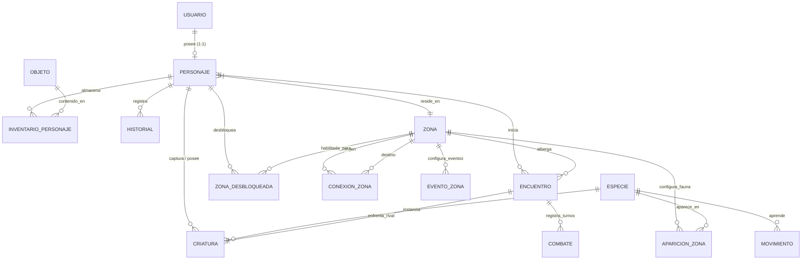

# Informe Técnico - Fase 5: Modelo de Datos, Mundo y Catálogo (Avance 3, Parte 2)

Este documento corresponde al capítulo de la **Fase 5 (Modelo de Datos, Mundo y Catálogo)** del Informe Técnico del Proyecto Integrador ISC-305. Documenta la definición del esquema relacional completo en PostgreSQL compuesto por 15 entidades, la migración versionada y el seed idempotente con Prisma ORM, el diseño topológico del mundo de Aethelgard, el catálogo de criaturas y objetos, y los módulos nucleares de Personaje, Equipo, Inventario y Mundo.

---

## 1. Introducción y decisiones de arquitectura de datos

### 1.1 Persistencia relacional en PostgreSQL y Prisma ORM
Para la persistencia integral de *Aethelgard: Sendas y Criaturas*, se seleccionó PostgreSQL 17 como motor relacional, orquestado a través de Prisma ORM (versión exacta 6.3.1). Esta combinación garantiza:
- **Integridad referencial estricta:** Restricciones de llaves foráneas y unicidad validadas a nivel del motor de base de datos.
- **Tipado seguro de extremo a extremo:** Los esquemas de Prisma generan automáticamente tipos TypeScript (`@prisma/client`) consumidos directamente por los servicios de NestJS.
- **Mapeo declarativo consistente:** Todas las entidades se nombran en PascalCase en español dentro del esquema de Prisma y se mapean explícitamente a nombres de tabla y columnas en minúsculas `snake_case` mediante las directivas `@@map` y `@map`, cumpliendo la regla R1 del proyecto.

### 1.2 Principio arquitectónico: Inyección directa sin abstracciones redundantes
Siguiendo las directrices de diseño eficiente ("Lazy Senior Developer"):
- Se prescindió de patrones Repository genéricos, UnitOfWork o capas DAO artificiales intermedias.
- Todas las consultas y mutaciones se efectúan inyectando directamente `PrismaService` en los servicios de dominio de NestJS (`PersonajesService`, `EquipoService`, `InventarioService`, `MundoService`).
- Las operaciones compuestas (creación de personaje con criatura inicial, inventario y desbloqueo; movimientos de equipo con balance de integrantes) se encapsulan en transacciones atómicas de Prisma (`prisma.$transaction`).

---

## 2. Diagrama Entidad-Relación y diccionario de datos

El esquema relacional de datos está compuesto por **15 tablas** interconectadas:

### 2.1 Diccionario de datos de las 15 entidades

1. **`usuario` (Identidad y autenticación):**
   - `id` (UUID, PK): Identificador único de la cuenta.
   - `nombre_usuario` (VARCHAR, UK): Nombre único para inicio de sesión.
   - `correo` (VARCHAR, UK): Correo electrónico del usuario.
   - `contrasena_hash` (TEXT): Hash seguro generado con bcrypt.
   - `fecha_creacion`, `fecha_actualizacion` (TIMESTAMP): Marcas temporales de auditoría.
   - Relación 1:1 con `personaje`.

2. **`personaje` (Explorador activo):**
   - `id` (UUID, PK): Identificador único del explorador.
   - `usuario_id` (UUID, FK, UK): Llave foránea hacia `usuario(id)` con eliminación en cascada.
   - `nombre` (VARCHAR): Nombre del explorador (3 a 20 caracteres).
   - `monedas` (INT): Saldo disponible (inicia en 100).
   - `ubicacion_actual_id` (VARCHAR, FK): Referencia a `zona(id)` (inicia en `"LOC-01"`).
   - `fecha_creacion`, `fecha_actualizacion` (TIMESTAMP).

3. **`zona` (Topología y mundo):**
   - `id` (VARCHAR, PK): Código canónico (`LOC-01` a `LOC-03`, `ZON-01` a `ZON-06`).
   - `nombre`, `descripcion` (TEXT): Textos descriptivos de la ambientación.
   - `tipo` (VARCHAR): `"LOCALIDAD"` o `"ZONA"`.
   - `es_segura` (BOOLEAN): `true` para localidades con servicios, `false` para zonas silvestres con encuentros.
   - `nivel_minimo`, `nivel_maximo` (INT, nullable): Rango de nivel sugerido.
   - `servicios` (TEXT[]): Listado de servicios autorizados (`CURACION`, `ALMACEN`, `TIENDA`, `HISTORIAL`).

4. **`conexion_zona` (Grafo topológico):**
   - `id` (UUID, PK): Identificador de la arista.
   - `zona_origen_id` (VARCHAR, FK): Localidad o zona de salida.
   - `zona_destino_id` (VARCHAR, FK): Localidad o zona de llegada.
   - Restricción de unicidad: `@@unique([zona_origen_id, zona_destino_id])`.

5. **`evento_zona` (Tabla de exploración ponderada):**
   - `id` (UUID, PK).
   - `zona_id` (VARCHAR, FK): Zona silvestre asociada.
   - `tipo` (VARCHAR): `"ENCUENTRO"`, `"OBJETO"`, `"SIN_EVENTO"`.
   - `peso` (INT): Peso probabilístico relativo (suma 100 por zona).
   - Restricción de unicidad: `@@unique([zona_id, tipo])`.

6. **`aparicion_zona` (Fauna silvestre por zona):**
   - `id` (UUID, PK).
   - `zona_id` (VARCHAR, FK): Zona donde habita la criatura.
   - `especie_id` (UUID, FK): Especie del catálogo.
   - `peso` (INT): Probabilidad de avistamiento relativo.
   - `nivel_minimo`, `nivel_maximo` (INT): Rango de nivel al aparecer.
   - Restricción de unicidad: `@@unique([zona_id, especie_id])`.

7. **`especie` (Catálogo normalizado):**
   - `id` (UUID, PK).
   - `id_externo` (VARCHAR, UK): Clave de origen en Open5e (`srd-2024_wolf`, etc.).
   - `nombre` (VARCHAR): Denominación en español.
   - `slug` (VARCHAR, UK): Identificador web en minúsculas (`lobo-gris`).
   - `tipo` (VARCHAR): Clasificación (`beast`, `undead`, `elemental`, etc.).
   - `challenge_rating` (FLOAT): Desafío original de Open5e.
   - `hp_base`, `ataque_base`, `defensa_base`, `velocidad_base` (INT): Estadísticas normalizadas en escala 30–100.
   - `tasa_captura` (FLOAT): Probabilidad calibrada entre 0.10 y 0.90.
   - `es_especial` (BOOLEAN): Señalizador de criatura rara (5 % en tablas de aparición).
   - `descripcion` (TEXT, nullable).

8. **`movimiento` (Ataques por especie):**
   - `id` (UUID, PK).
   - `especie_id` (UUID, FK): Especie vinculada.
   - `nombre_original` (VARCHAR): Nombre en inglés según Open5e.
   - `nombre` (VARCHAR): Traducción oficial al español.
   - `tipo_accion` (VARCHAR): `"Ataque melé"` o `"Ataque distancia"`.
   - `poder` (FLOAT): Daño promedio calibrado del ataque.

9. **`criatura` (Ejemplar individual):**
   - `id` (UUID, PK).
   - `personaje_id` (UUID, FK, nullable): Propietario (o null si es salvaje no capturada).
   - `especie_id` (UUID, FK): Referencia a `especie(id)`.
   - `apodo` (VARCHAR, nullable).
   - `nivel` (INT): Nivel de experiencia (inicia en 1).
   - `experiencia` (INT): Puntos de experiencia acumulados (inicia en 0).
   - `hp_actual`, `hp_maximo` (INT).
   - `ataque`, `defensa`, `velocidad` (INT).
   - `en_equipo` (BOOLEAN): `true` si acompaña activamente al explorador (máximo 6), `false` si reside en almacén.
   - `orden_equipo` (INT, nullable): Posición 1 a 6 dentro del equipo.
   - `fecha_captura` (TIMESTAMP).

10. **`objeto` (Catálogo de artículos):**
    - `id` (UUID, PK).
    - `codigo` (VARCHAR, UK): `talisman-basico`, `pocion-menor`, etc.
    - `nombre`, `descripcion` (VARCHAR).
    - `tipo` (VARCHAR): `"CAPTURA"`, `"CURACION"`.
    - `precio_compra`, `precio_venta` (INT).
    - `efecto_valor` (INT): Multiplicador de captura o puntos de salud restaurados.

11. **`inventario_personaje` (Posesión de consumibles):**
    - `id` (UUID, PK).
    - `personaje_id` (UUID, FK): Explorador poseedor.
    - `objeto_id` (UUID, FK): Artículo poseído.
    - `cantidad` (INT): Unidades en posesión.
    - Restricción de unicidad: `@@unique([personaje_id, objeto_id])`.

12. **`encuentro` (Estado transitorio de combate):**
    - `id` (UUID, PK).
    - `personaje_id` (UUID, FK).
    - `zona_id` (VARCHAR, FK).
    - `criatura_rival_id` (UUID, FK): Criatura salvaje generada.
    - `estado` (VARCHAR): `"EN_CURSO"`, `"VICTORIA"`, `"DERROTA"`, `"HUIDO"`, `"CAPTURADO"`.
    - `fecha_creacion`, `fecha_resolucion` (TIMESTAMP).

13. **`combate` (Bitácora táctica de turnos):**
    - `id` (UUID, PK).
    - `encuentro_id` (UUID, FK).
    - `turno` (INT): Número secuencial de turno.
    - `es_turno_jugador` (BOOLEAN).
    - `accion_ultima` (VARCHAR, nullable): Acción resuelta.
    - `detalle_json` (JSONB, nullable): Registro estructurado de daño o efectos.

14. **`zona_desbloqueada` (Control de progresión territorial):**
    - `id` (UUID, PK).
    - `personaje_id` (UUID, FK).
    - `zona_id` (VARCHAR, FK).
    - `fecha_desbloqueo` (TIMESTAMP).
    - Restricción de unicidad: `@@unique([personaje_id, zona_id])`.

15. **`historial` (Bitácora del explorador):**
    - `id` (UUID, PK).
    - `personaje_id` (UUID, FK).
    - `tipo` (VARCHAR): `"EXPLORACION"`, `"COMBATE"`, `"CAPTURA"`.
    - `descripcion` (TEXT).
    - `datos_json` (JSONB, nullable).
    - `fecha_registro` (TIMESTAMP).

---

## 3. Estrategia de normalización e invariantes de integridad

El diseño cumple la Tercera Forma Normal (3FN), garantizando:
- **Ausencia de redundancia:** Las estadísticas base y nombres residen en `especie`; el ejemplar en `criatura` almacena únicamente estado mutable (HP actual, nivel, XP, apodo).
- **Índices únicos compuestos:**
  - `conexion_zona`: Evita aristas duplicadas en el grafo topológico (`zona_origen_id` + `zona_destino_id`).
  - `evento_zona`: Garantiza un solo registro de probabilidad por tipo de evento en cada zona (`zona_id` + `tipo`).
  - `aparicion_zona`: Previene registros redundantes para una misma especie en una zona (`zona_id` + `especie_id`).
  - `inventario_personaje`: Modela posesiones aditivas agregando cantidad sobre la tupla (`personaje_id` + `objeto_id`).
  - `zona_desbloqueada`: Controla estados de progresión sin duplicidades (`personaje_id` + `zona_id`).
- **Políticas de eliminación referencial:**
  - Eliminación en cascada (`Cascade`) en posesiones y registros derivados del explorador (`inventario_personaje`, `zona_desbloqueada`, `historial`, `criatura`).
  - Restricción estricta (`Restrict`) en referencias a catálogos base (`especie`, `zona`, `objeto`), impidiendo la supresión accidental de datos maestros.

---

## 4. Mecanismo de sembrado (seed) e idempotencia

El proceso de sembrado implementado en `apps/api/prisma/seed.ts` e invocado mediante `pnpm --filter api exec prisma db seed` garantiza idempotencia total:
- Cada entidad se persiste utilizando la cláusula `upsert` de Prisma con llaves únicas canónicas (`id` para zonas y conexiones, `codigo` para objetos, combinaciones únicas compuestas para eventos).
- Se ejecutó de forma consecutiva sin arrojar colisiones de llave primaria ni duplicar registros existentes.
- Provee de forma determinista las 3 localidades seguras (`LOC-01`, `LOC-02`, `LOC-03`), las 6 zonas silvestres (`ZON-01` a `ZON-06`), las 20 conexiones bidireccionales del grafo del mundo, los 18 eventos ponderados de exploración y los 4 consumibles base del juego.
