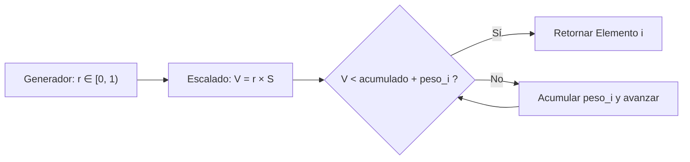
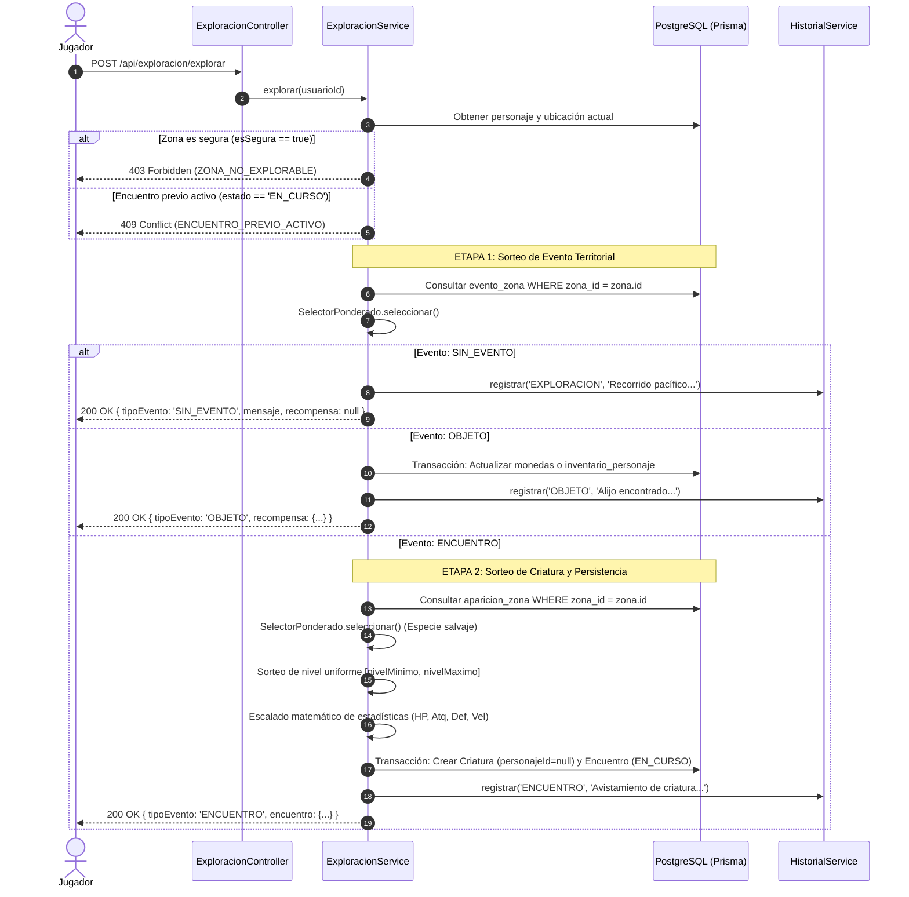

# Informe Técnico - Fase 6: Exploración, Encuentros e Historial (Avance 3, Parte 3)

Este documento corresponde al capítulo de la **Fase 6 (Reglas de Juego: Exploración, Encuentros e Historial)** del Informe Técnico del Proyecto Integrador ISC-305. Documenta la arquitectura del motor probabilístico y determinista del juego, el desacoplamiento del azar mediante abstracciones inyectables, el cumplimiento estricto del invariante matemático **INV-01**, el sorteo en dos etapas de exploración territorial y la persistencia relacional íntegra de encuentros activos y bitácora transversal.

---

## 1. Desacoplamiento y arquitectura de aleatoriedad (§3)

### 1.1 El dilema del azar en sistemas evaluables y de alta fidelidad
En el desarrollo de videojuegos y motores de simulación, el uso descontrolado de generadores de números pseudoaleatorios acoplados directamente al entorno de ejecución (como `Math.random()` en JavaScript/Node.js) genera graves patologías de ingeniería de software:
- **Pruebas no reproducibles (Flaky Tests):** Las aserciones automatizadas dependen de valores impredecibles, lo que dificulta la verificación de casos de borde y condiciones de frontera.
- **Dificultad de auditoría:** No es posible recrear una secuencia exacta de decisiones de un jugador o estado de combate reportado por un usuario ante un fallo en producción.
- **Violación del principio de inversión de dependencias:** Los servicios de dominio asumen la responsabilidad colateral de obtener entropía del sistema en lugar de delegarla.

### 1.2 Interfaz pura e inyectable: `GeneradorAleatorio`
Para solucionar este dilema, la arquitectura del proyecto desacopló formalmente la generación de valores en el intervalo continuo $[0, 1)$ a través de un contrato puro:

```typescript
export interface GeneradorAleatorio {
  /**
   * Genera un número pseudoaleatorio en el intervalo uniforme [0, 1).
   */
  generar(): number;
}
```

A partir de este contrato, se implementaron dos concreciones:
1. **`GeneradorAleatorioNativo`:** Empleado en el entorno de producción y ejecución regular del servidor NestJS, encapsula `Math.random()` nativo de V8/Node.js sin sobrecarga de capas adicionales.
2. **`GeneradorAleatorioFijo`:** Empleado en suites de pruebas unitarias e integración, recibe una secuencia determinista inmutable de números de punto flotante precalculados (ej. `[0.0, 0.59, 0.60, 0.85]`). Cada invocación avanza secuencialmente por el arreglo, garantizando que el 100 % de los casos de prueba sigan un camino de ejecución determinista y reproducible al milisegundo.

### 1.3 Utilitario puro de selección ponderada: `SelectorPonderado`
La selección entre múltiples opciones con pesos arbitrarios no se implementa de forma dispersa en controladores o servicios. Se encapsula en la clase utilitaria genérica `SelectorPonderado<T>` (`apps/api/src/comun/azar/selector-ponderado.util.ts`), la cual:
- Recibe una colección genérica de pares `{ elemento: T, peso: number }`.
- Inyecta por parámetro opcional cualquier instancia de `GeneradorAleatorio` (utilizando por defecto `GeneradorAleatorioNativo`).
- Precalcula la suma acumulada total de pesos durante la instanciación.
- Garantiza que la lógica matemática del sorteo sea completamente reutilizable tanto para tablas de eventos de zona como para tablas de fauna/especies salvajes.

---

## 2. Cumplimiento matemático del invariante INV-01

### 2.1 Definición formal del invariante INV-01
El invariante **INV-01** establece que:
$$\sum_{i=1}^k \text{peso}_i > 0 \quad \land \quad \forall i \in \{1, \dots, k\}, \; \text{peso}_i \ge 0$$

Ninguna tabla probabilística de aparición territorial o de eventos de exploración puede estar vacía, contener pesos negativos o sumar cero.

### 2.2 Validación algorítmica en tiempo de construcción
El constructor de `SelectorPonderado<T>` impone salvaguardas estrictas que impiden la instanciación de un selector en un estado matemáticamente inconsistente:

```typescript
if (!items || items.length === 0) {
  throw new Error('La lista de elementos a ponderar no puede estar vacía.');
}

this.sumaPesos = items.reduce((acumulado, actual) => {
  if (actual.peso < 0) {
    throw new Error(`El peso de un elemento no puede ser negativo: ${actual.peso}`);
  }
  return acumulado + actual.peso;
}, 0);

if (this.sumaPesos <= 0) {
  throw new Error('INV-01: La suma total de pesos debe ser estrictamente positiva (> 0).');
}
```

### 2.3 Mecánica de normalización y búsqueda acumulativa
Una vez garantizado que la suma total $S > 0$:
1. Sea $r \in [0, 1)$ el número flotante pseudoaleatorio generado por la abstracción inyectada.
2. Se escala el valor al espacio muestral continuo $[0, S)$:
   $$V = r \times S$$
3. Se itera secuencialmente acumulando los pesos parciales hasta encontrar el primer índice $j$ que verifique:
   $$\sum_{i=1}^j \text{peso}_i > V$$
4. Dicho elemento $j$ es devuelto como la selección formal del sorteo.



Esta búsqueda acumulativa lineal posee una complejidad temporal $O(k)$ con $k \le 5$, lo cual es óptimo en uso de memoria y procesador para las tablas relacionales del juego sin requerir indexación binaria redundante.

---

## 3. Mecánica de exploración en dos etapas (M-EXP, CFG, A-8)

El diseño del motor de exploración desacopla el azar en dos etapas secuenciales parametrizadas 100 % en base de datos (`CFG`), garantizando la regla arquitectónica **A-8** (todas las reglas son evaluadas y validadas en el servidor; el cliente web solo renderiza el resultado devuelto).

### 3.1 Diagrama de flujo de exploración



### 3.2 Escalado de estadísticas de criaturas salvajes
Cuando la Etapa 2 selecciona una especie rival, sus estadísticas base son calibradas dinámicamente según el nivel sorteado mediante fórmulas deterministas en el servidor:
- Factor de combate: $F_{\text{combate}} = 1 + (\text{nivel} - 1) \times 0.10$
- Factor de velocidad: $F_{\text{velocidad}} = 1 + (\text{nivel} - 1) \times 0.05$
- Puntos de golpe máximos: $\text{hpMaximo} = \text{round}(\text{hpBase} \times F_{\text{combate}})$
- Puntos de ataque: $\text{ataque} = \text{round}(\text{ataqueBase} \times F_{\text{combate}})$
- Puntos de defensa: $\text{defensa} = \text{round}(\text{defensaBase} \times F_{\text{combate}})$
- Velocidad: $\text{velocidad} = \text{round}(\text{velocidadBase} \times F_{\text{velocidad}})$

---

## 4. Matriz de tablas ponderadas por zona (CFG)

Todas las zonas silvestres (`ZON-01` a `ZON-06`) cuentan con sus tablas sembradas en PostgreSQL con $\sum \text{peso} = 100$ exactos.

### 4.1 Tablas de eventos de exploración (Etapa 1)

| Zona | Nombre de la Zona | ENCUENTRO (%) | OBJETO (%) | SIN_EVENTO (%) | Total Suma |
| :--- | :--- | :---: | :---: | :---: | :---: |
| **ZON-01** | Praderas del Amanecer | 60 % | 25 % | 15 % | 100 (INV-01) |
| **ZON-02** | Bosque Susurrante | 65 % | 20 % | 15 % | 100 (INV-01) |
| **ZON-03** | Riberas del Lago Espejo | 65 % | 20 % | 15 % | 100 (INV-01) |
| **ZON-04** | Paso de los Riscos | 70 % | 15 % | 15 % | 100 (INV-01) |
| **ZON-05** | Cueva Umbría | 75 % | 15 % | 10 % | 100 (INV-01) |
| **ZON-06** | Pico de la Cumbre | 80 % | 10 % | 10 % | 100 (INV-01) |

### 4.2 Tablas de fauna y criaturas especiales (Etapa 2)

Cada zona silvestre reserva exactamente un **5 %** de probabilidad para su criatura de avistamiento especial:

| Zona | Especies Comunes / Frecuentes | Criatura Especial (5 %) | Rango de Nivel |
| :--- | :--- | :--- | :---: |
| **ZON-01** | Lobo Gris (40 %), Pico de Hacha (35 %), Araña Lobo Gigante (20 %) | **Lobo Huargo** | 1 – 3 |
| **ZON-02** | Oso Negro (40 %), Cocatriza (35 %), Árbol Despierto (20 %) | **Osobuho** | 2 – 5 |
| **ZON-03** | Oso Pardo (40 %), Tigre Dientes de Sable (35 %), Alosaurio (20 %) | **Hidra de las Marismas** | 3 – 6 |
| **ZON-04** | Grifo (40 %), Gárgola (35 %), Mantícora (20 %) | **Quimera Tricéfala** | 5 – 8 |
| **ZON-05** | Esqueleto Guerrero (35 %), Zombi Putrefacto (30 %), Necrófago (20 %), Basilisco (10 %) | **Hombre Lobo** | 7 – 10 |
| **ZON-06** | Lobo Invernal (35 %), Armadura Animada (30 %), Elemental de Fuego (18 %), Elemental de Aire (12 %) | **Quimera Tricéfala** | 8 – 12 |

---

## 5. Persistencia del estado de encuentro y bitácora transversal

### 5.1 Persistencia relacional de encuentros (`M-ENC`)
A diferencia de arquitecturas basadas en memoria volátil o sesiones efímeras, los encuentros en *Aethelgard* persisten de forma transaccional en PostgreSQL (`prisma.$transaction`):
1. La criatura rival generada se inserta en la tabla `criatura` con `personaje_id = NULL`, marcando que pertenece al entorno salvaje.
2. El registro del combate se crea en la tabla `encuentro` con estado `EN_CURSO` asociando la criatura rival, el personaje y la zona.
3. Si el servidor de NestJS o el navegador del cliente se reinicia o se pierde la conexión, la sesión no se corrompe: el endpoint `GET /api/encuentros/activo` consulta directamente la base de datos y recupera el combate con su criatura aliada y rival intactas.

### 5.2 Bitácora transversal e historial paginado (`M-HIS`)
El `HistorialService` actúa como bitácora centralizada accesible para todos los subsistemas del juego. Toda exploración (`EXPLORACION`, `OBJETO`, `ENCUENTRO`) genera registros estructurados con marca de tiempo UTC. La consulta vía `GET /api/historial` implementa paginación estricta (`skip`/`take`) con orden cronológico descendente y metadatos de navegación (`total`, `pagina`, `limite`), garantizando transferencias de datos compactas y escalables.
