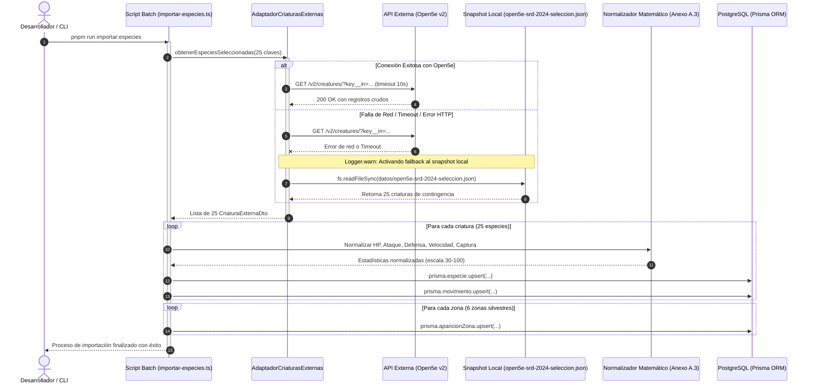

# Informe Técnico - Fase 5: Integración Externa y Normalización de Catálogo (Avance 3, Parte 2)

Este documento corresponde a la primera versión del capítulo de la **Integración Externa** del Informe Técnico del Proyecto Integrador ISC-305. Registra el diseño y construcción del adaptador de criaturas externas contra la API de Open5e (`srd-2024`), la arquitectura de desacoplamiento por lotes, el modelo de contingencia con snapshot estático local versionado, las fórmulas matemáticas de normalización para equilibrar el catálogo y el marco legal de licenciamiento y atribución de contenido.

---

## 1. Desacoplamiento y arquitectura de integración

### 1.1 Principio de aislamiento en tiempo de ejecución (EXT)
Una de las decisiones arquitectónicas fundamentales de *Aethelgard: Sendas y Criaturas* es el **desacoplamiento total entre el tiempo de ejecución del juego y los proveedores externos de datos**:
- **Cero llamadas externas en juego:** Ningún controlador REST (`PersonajesController`, `MundoController`, `EquipoController`, etc.) ni servicio en tiempo real ejecuta peticiones HTTP hacia Open5e. La aplicación web y el servidor operan exclusivamente contra la base de datos relacional PostgreSQL.
- **Ventajas de fiabilidad y rendimiento:**
  - Inmunidad a caídas de red, cuotas de consumo o lentitud en APIs de terceros durante las partidas.
  - Tiempos de respuesta predecibles inferiores a 50 milisegundos en todas las acciones de navegación y consulta.
- **Integración por lotes bajo demanda:** La importación de datos se realiza mediante un script de consola dedicado (`pnpm --filter api run importar:especies`), ejecutado una sola vez durante el despliegue o sincronización del catálogo.

---

## 2. Frontera de datos (Anexo A.2)

La frontera de datos delimita con precisión la procedencia de cada atributo del sistema:

| Atributo en Base de Datos | Origen | Justificación y tratamiento |
| --- | --- | --- |
| `idExterno` (`key`) | Open5e | Identificador alfanumérico único asignado por la fuente (`srd-2024_wolf`, etc.). |
| `tipo` | Open5e | Tipo de criatura según D&D 5e (`type.key`: `beast`, `undead`, `monstrosity`, `elemental`, `construct`, `plant`). |
| Estadísticas fuente crudas | Open5e | `challenge_rating`, `hit_points`, `armor_class`, `speed_all`, `actions[].attacks`. |
| `nombre`, `slug` | Propio | Nombre y slug en español (`Lobo Gris`, `lobo-gris`). El nombre en inglés de Open5e **nunca** se expone al jugador. |
| `descripcion` | Propio | Descripción literaria adaptada a la mitología y geografía de Aethelgard. |
| `hpBase`, `ataqueBase`, `defensaBase`, `velocidadBase` | Propio | Estadísticas calibradas mediante normalización lineal sobre los extremos del catálogo. |
| `tasaCaptura` | Propio | Probabilidad calibrada inversamente proporcional al `challenge_rating`. |
| `movimientos` | Mixto | El poder numérico se deriva de los dados de daño de Open5e; el nombre y tipo en español son de diseño propio. |
| Nivel, XP, HP actual, pertenencia, orden | Propio | Estado del explorador y dinámica del juego; nunca provienen de la API externa. |
| Tablas de aparición y eventos | Propio | Distribución ecológica por zonas definida en `docs/catalogo-criaturas.md`. |

---

## 3. Normalización matemática de estadísticas (Anexo A.3)

Como las magnitudes numéricas del SRD 5e no corresponden a la escala requerida por un sistema de juego web balanceado, se calibró una normalización matemática lineal sobre los valores extremos del catálogo de 25 especies seleccionadas.

### 3.1 Extremos del catálogo seleccionado
- **Puntos de golpe (HP):** $\text{mínimo} = 11$ (`srd-2024_wolf`), $\text{máximo} = 184$ (`srd-2024_hydra`).
- **Promedio de mejor ataque:** $\text{mínimo} = 3.5$ (`srd-2024_cockatrice`), $\text{máximo} = 15.0$ (`srd-2024_allosaurus`).
- **Clase de armadura (AC):** $\text{mínimo} = 8$ (`srd-2024_zombie`), $\text{máximo} = 18$ (`srd-2024_animated-armor`).
- **Velocidad máxima:** $\text{mínimo} = 20$ (`srd-2024_zombie`), $\text{máximo} = 90$ (`srd-2024_air-elemental`).

### 3.2 Fórmulas de escala canónica (escala 30 a 100)
Cada estadística se mapea según la relación:
$$\text{estadísticaBase} = \operatorname{redondear}\left(30 + 70 \times \frac{\text{valorFuente} - \text{mínimo}}{\text{máximo} - \text{mínimo}}\right)$$

- **Puntos de salud:**
  $$\text{hpBase} = \operatorname{redondear}\left(30 + 70 \times \frac{\text{hit\_points} - 11}{184 - 11}\right)$$
- **Poder de ataque:**
  Calculado sobre el mejor ataque disponible:
  $$\text{ataqueBase} = \operatorname{redondear}\left(30 + 70 \times \frac{\text{mejorAtaque} - 3.5}{15.0 - 3.5}\right)$$
- **Defensa:**
  $$\text{defensaBase} = \operatorname{redondear}\left(30 + 70 \times \frac{\text{armor\_class} - 8}{18 - 8}\right)$$
- **Velocidad:**
  $$\text{velocidadBase} = \operatorname{redondear}\left(30 + 70 \times \frac{\text{speedMax} - 20}{90 - 20}\right)$$

### 3.3 Tasa de captura
Para asegurar que las criaturas de mayor desafío resulten más complejas de capturar:
$$\text{tasaCaptura} = \operatorname{clamp}\left(0.10,\, 0.90,\, 0.90 - 0.07 \times \text{challengeRating}\right)$$

### 3.4 Cálculo y traducción de movimientos
Para cada acción de combate que contenga ataques:
$$\text{poder} = \text{damage\_die\_count} \times \left(\frac{\text{ladosDelDado}}{2} + 0.5\right) + (\text{damage\_bonus} \mathbin{??} 0)$$
El sistema traduce el nombre técnico en inglés al nombre canónico de fantasía en español mediante `TRADUCCION_MOVIMIENTOS` (ej. `Shortsword` $\rightarrow$ "Tajo de Espada Corta", `Thunderous Slam` $\rightarrow$ "Ráfaga Trueno").

---

## 4. Mecanismo de tolerancia a fallos y contingencia (Anexo A.4)

Para garantizar la reproducibilidad y robustez de la importación ante contingencias de conectividad:
1. **Timeout con `AbortController`:** La petición HTTP nativa hacia `https://api.open5e.com/v2/creatures/` está protegida por un temporizador de 10 segundos.
2. **Snapshot estático local versionado:** En `datos/open5e-srd-2024-seleccion.json` se almacena el snapshot completo de las 25 especies seleccionadas con su estructura cruda.
3. **Fallback transparente:** Si la API devuelve un código de error ($\ge 400$), se agota el tiempo de espera o se interrumpe la conexión, el servicio `AdaptadorCriaturasExternas` emite una advertencia de registro (`Logger.warn`) y procesa de forma transparente el archivo snapshot local.
4. **Verificación automatizada:** Una prueba unitaria dedicada (`adaptador-criaturas-externas.spec.ts`) valida que, al simular una desconexión total de red mediante simulación de error en `fetch`, el adaptador se activa de inmediato sobre el snapshot y devuelve las 25 especies con atributos íntegros.

---

## 5. Licenciamiento y atribución legal

Los datos de origen de las criaturas utilizadas provienen del documento oficial `srd-2024` indexado por Open5e, el cual se rige bajo los siguientes términos legales:
- **Licencia Open Game License (OGL v1.0a):** Otorgada por Wizards of the Coast para el uso de mecánicas y estadísticas de referencia abierta.
- **Creative Commons Attribution 4.0 International (CC-BY-4.0):** Reconocimiento de los derechos correspondientes al contenido del System Reference Document 5.2.
- **Atribución de Aethelgard:** En cumplimiento con los términos de dichas licencias y las pautas del plan maestro:
  1. Se acredita expresamente la autoría de Wizards of the Coast y Open5e en este informe técnico.
  2. Los nombres propios de ambientación, descripciones literarias en español, sistema de talismanes, mapa de Aethelgard y balance de estadísticas son creaciones intelectuales originales del equipo de desarrollo de la asignatura.
  3. La interfaz web incorporará en su vista de créditos los avisos de atribución de Open5e y la licencia MIT de los componentes utilizados.
